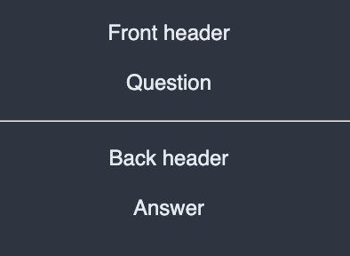
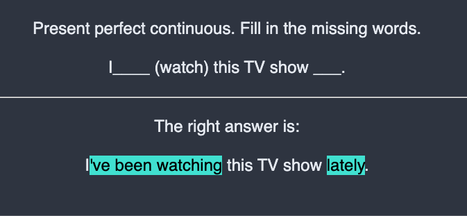
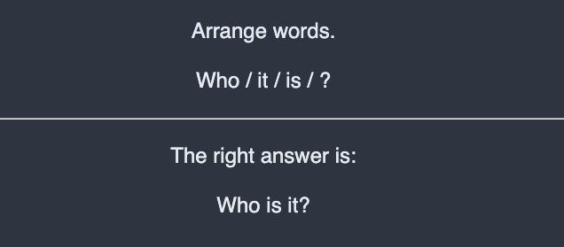

# cmdenglishassist

It Is your daily English learning assistance app.

## Installation

```bash
curl -s https://raw.githubusercontent.com/obaranovskyi/cmdenglishassist/main/install.sh | bash /dev/stdin
```

## Usage

To use `cmdenglishassist`:

1. Enter words in google translate and split by colon;
2. Copy the URL;
3. Use it with the current app to generate:
   - json with translations
   - mp3 with translations
   - english flashcards
   - anki flashcards

To generate the json with translations, run:

```bash
cmdenglishassist json 'https://translate.google.com/?sl=en&tl=uk&text=1.%20Enter%20words%20in%20google%20translate%20and%20split%20by%20colon%3B%0A2.%20Copy%20URL%20%0A3%20Use%20it%20with%20the%20current%20app%20to%20generate%20the%3A%0A&op=translate'
```

To generate the mp3 with translations, run:

```bash
cmdenglishassist audio 'https://translate.google.com/?sl=en&tl=uk&text=1.%20Enter%20words%20in%20google%20translate%20and%20split%20by%20colon%3B%0A2.%20Copy%20URL%20%0A3%20Use%20it%20with%20the%20current%20app%20to%20generate%20the%3A%0A&op=translate'
```

To generate the flashcards in pdf, run:

```bash
cmdenglishassist card 'https://translate.google.com/?sl=en&tl=uk&text=1.%20Enter%20words%20in%20google%20translate%20and%20split%20by%20colon%3B%0A2.%20Copy%20URL%20%0A3%20Use%20it%20with%20the%20current%20app%20to%20generate%20the%3A%0A&op=translate'
```

To generate anki flashcards, run:

```bash
cmdenglishassist anki 'https://translate.google.com/?sl=en&tl=uk&text=1.%20Enter%20words%20in%20google%20translate%20and%20split%20by%20colon%3B%0A2.%20Copy%20URL%20%0A3%20Use%20it%20with%20the%20current%20app%20to%20generate%20the%3A%0A&op=translate'
```

#### Complex anki questions

The complex questions might be generated from the JSON file.

In `question_type.py` we have all the types that can be used:

```python
class QuestionType(Enum):
    SIMPLE_QUESTION = 1
    HIDDEN_WORD_IN_SENTENCE = 2
    RANDOM_WORD_SENTENCE = 3
```

###### Simple question

JSON example:

```json
{
    "type": 1,
    "questionTitle": "Front header",
    "question": "Question",
    "answerTitle": "Back header",
    "answer": "Answer"
}
```

###### 

###### Sentence with hidden words

JSON example:

```json
{
    "type": 2,
    "questionTitle": "Present perfect continuous. Fill in the missing words.",
    "answerTitle": "The right answer is:",
    "src": "I{0} this TV show {1}.",
    "answers": ["'ve been watching", "lately"],
    "questions": ["____ (watch)", "___"]
}
```



###### 

###### Sentence with wrong word order

JSON example:

```json
{
    "type": 3,
    "questionTitle": "Arrange words.",
    "answerTitle": "The right answer is:",
    "src": "Who is it?"
}
```

## 

### Yaml alternative
It's important to note that instead of JSON can be used Yaml format as an alternative.

The previous JSON can be translated to Yaml in the following way:
```yaml
- type: 1
  questionTitle: Front header
  question: Question
  answerTitle: Back header
  answer: Answer
- type: 2
  questionTitle: Present perfect continuous. Fill in the missing words.
  answerTitle: 'The right answer is:'
  src: I{0} this TV show {1}.
  answers: 
    - "'ve been watching"
    - lately
  questions:
    - ____ (watch)
    - ___
- type: 3
  questionTitle: Arrange words.
  answerTitle: 'The right answer is:'
  src: Who is it?
```


## Uninstall

To uninstall run the following script

```bash
curl -s https://raw.githubusercontent.com/obaranovskyi/cmdenglishassist/main/uninstall.sh | bash /dev/stdin
```
